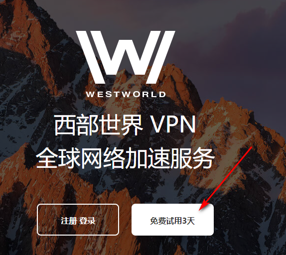
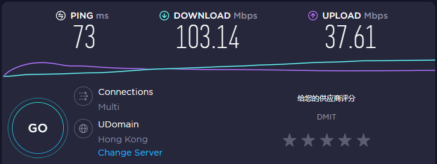
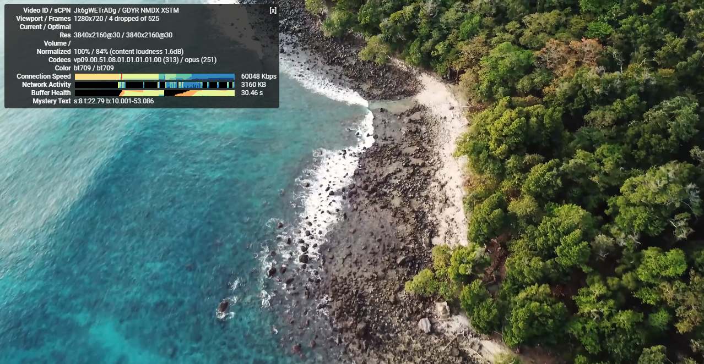

# 能够试用的VPN梯子软件，电脑手机上都好用的梯子机场

俗话说免费的才是最贵的，当下这种环境，一个**免费的VPN梯子**摆在大伙面前，估计出于安全和信息保密因素的考虑，很多人也不敢去用。但是我觉得，就算是**付费的VPN梯子**，能够给大家提供免费试用，这也是很重要的。

试用的时间长短，不仅体现了开发者和运营团队对于自己产品的信心，也是为大家提供了一重保障，不至于花钱买了一个不合心意的产品。

今天就给大家推荐一款**能够试用的梯子软件**，而且提供试用的时间也不短，有三天的时间，给了大家充足的时间能够摸清这款软件的性能以及是否适合自己。

这款能够试用的梯子软件名字叫做西部世界，是一款比较老牌的梯子软件，官网地址是：[点击访问官网](https://xbsj4621.fun/i/art081)

运营至今应该有三四年时间了，所以的话不用担心跑路的问题，毕竟如果是刚成立的梯子，肯定信誉不会那么高。

西部世界VPN支持新用户的三天免费试用，而且同时也支持手机电脑客户端的使用，不管你的设备是windows电脑，还是mac电脑，又或者是ios系统的苹果手机，安卓手机，都能在他们的官网上找到对应的客户端，下载并且使用。

软件也是采用了高等级的加密方式，确保了用户的隐私安全和杜绝了信息泄露的问题。

这款梯子机场也有订阅链接，大家能够配合第三方软件，比如clash或者V2rayN又或者是小火箭等等使用，当然我个人感觉最方便的还是下载他们的官方客户端，一键下载安装登录就能够进行翻墙啦。

他们后台的节点线路地区也很丰富，不用担心没有自己心怡的地区，所有线路都是采用的IEPL专线，没有高峰时期网络拥堵的烦恼，保证了一天24小时网速可以稳定运行。

同时网速也很快，看Youtube 4K超高清视频没有压力，整个过程一镜到底，中间不会出现哪怕任何一次卡顿，非常流畅，纵使是频繁使用快进功能，超高的网速也能让缓冲瞬间跟上。

而且因为是有三四年的运营时间下来了，所以不用担心说用了一段时间就用不了这种问题，我用这个梯子软件已经快两年了，一直没有换过，不管是学习工作，娱乐追剧，都给我带来了非常良好的体验感。

后台有V2ray和Trojan两种协议，最大程度做到了防封和坚挺。

以下是我用西部世界VPN梯子的测速截图，给大家做个参考，我自己用的是移动100M网络宽带，如果是用电信宽带的话，我感觉网速还能更快。

SpeedTest测速截图：

Youtube 4K测速截图：

## 如果你需要一款[稳定好用的梯子](http://react-china.org/t/topic/38279)同时也支持免费试用的VPN，那么不妨试试这款，性价比很高，收费也很低，而且三天的免费试用时间，也能够全方位体验这款梯子的极速享受。
